# Tutorial do Presidente CPCA

Como acessar: `http://cipavd.ccabr.intraer/`.

## 1. Solicitar cadastro como presidente CPCA

Na tela de login, clique em **Presidência CPCA**.

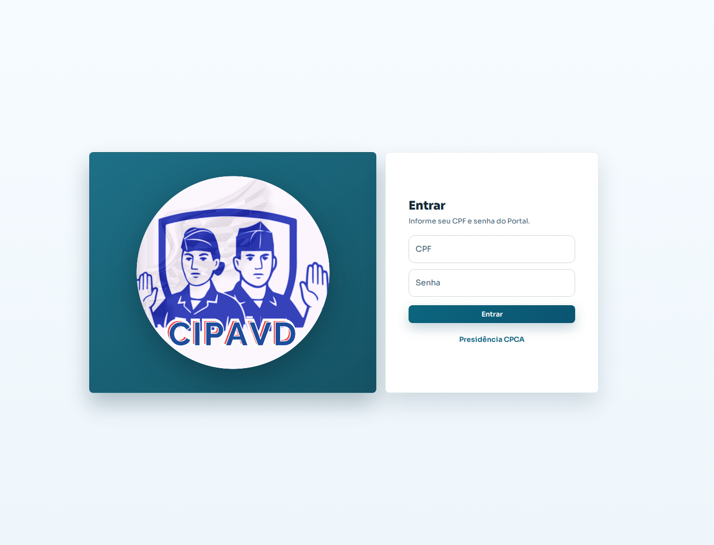

Na aba **Solicitar**, preencha o e-mail ou CPF, clique em **Buscar**, confira os dados retornados, informe se é substituição, preencha o número do boletim e anexe a publicação em PDF, PNG ou JPG.

Após revisar os dados, clique em **Enviar para homologação**.

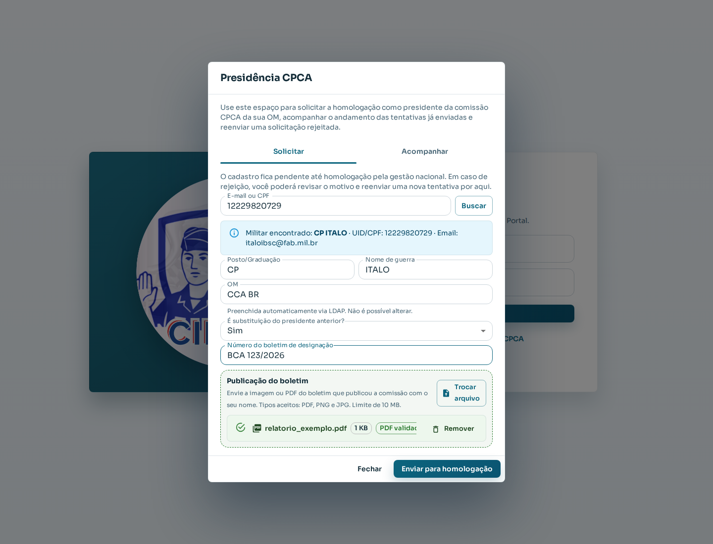

## 2. Acompanhar a homologação

Enquanto o COMGEP não aprovar a solicitação, o presidente pode voltar ao mesmo botão **Presidência CPCA**, abrir a aba **Acompanhar**, informar CPF ou e-mail e clicar em **Consultar**.

O sistema mostra o status mais recente, o histórico de tentativas e, se houver rejeição, o motivo para correção e reenvio.

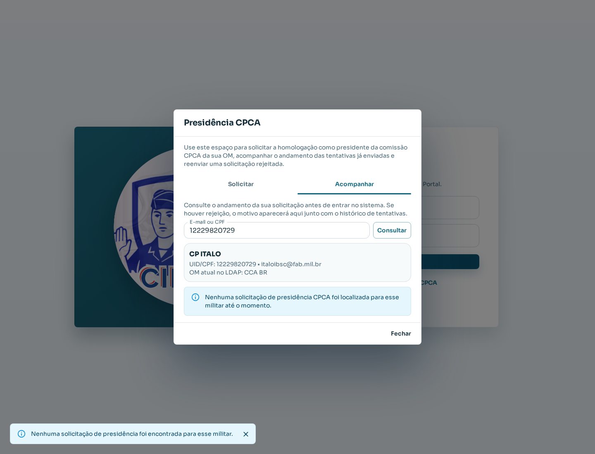

## 3. Primeiro login e cadastro do 2FA

Depois da homologação, o presidente faz login com CPF e senha. No primeiro acesso, o sistema solicita a configuração da autenticação em dois fatores.

Na tela de 2FA:

1. Instale o **Google Authenticator** no celular.
2. Escaneie o QR Code exibido.
3. Digite o código de 6 dígitos gerado no aplicativo.
4. Clique em **Confirmar e Ativar**.

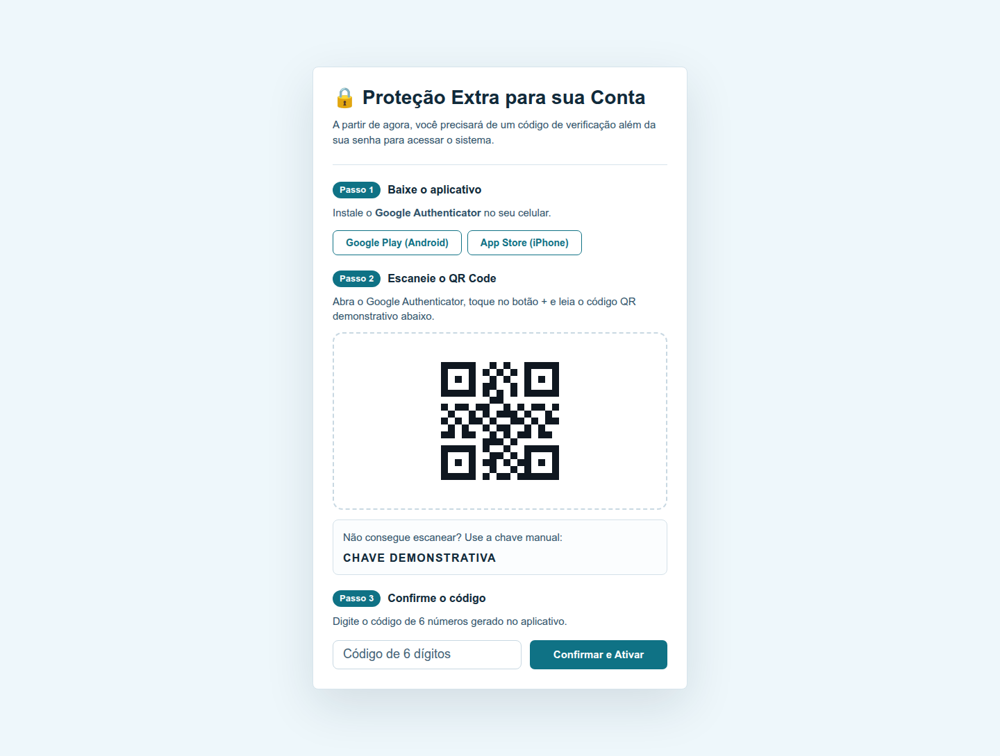

Depois da ativação, o sistema exibe códigos de recuperação. Guarde esses códigos em local seguro, marque a confirmação e conclua o acesso.

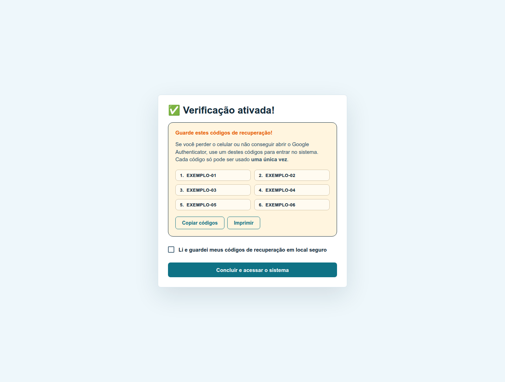

## 4. Acesso ao módulo CPCA

Com o papel `CPCA` ativo, o presidente acessa o bloco **CPCA** no menu lateral. Para o tutorial do presidente, use apenas:

- **Denúncias**
- **Comissão CPCA**

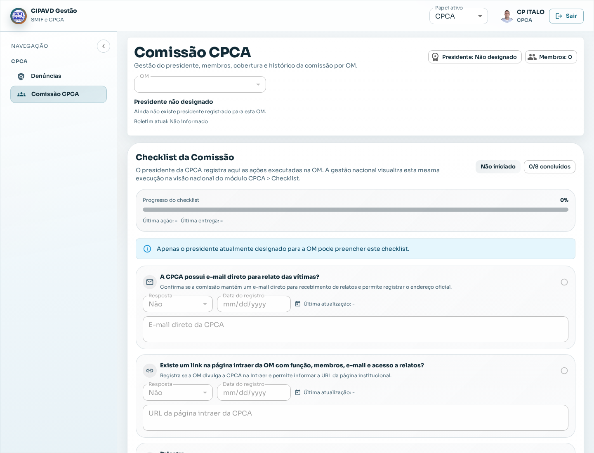

## 5. Preencher o checklist da comissão

Acesse **CPCA > Comissão CPCA**. No bloco **Checklist da Comissão**, acompanhe o progresso geral e registre as ações executadas pela comissão da OM.

Cada item do checklist aparece em uma linha. Clique na seta do item que deseja preencher para abrir os campos. Para os itens de resposta direta, como e-mail e página Intraer, selecione **Sim**, informe a data e preencha o campo correspondente. Para ações como palestra, seminário, materiais, mensagens, pop-ups e reunião de apresentação, abra o item e use **Adicionar registro** para informar data e detalhamento.

Ao terminar, clique em **Salvar checklist**.

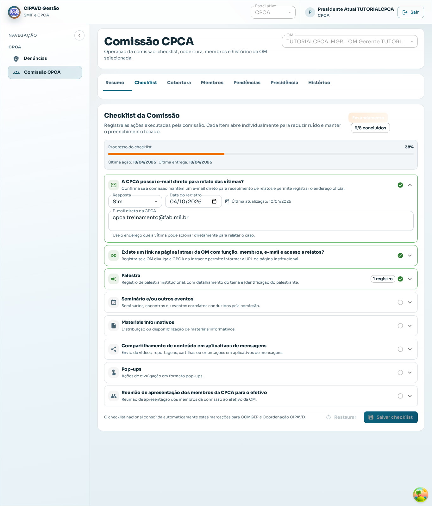

## 6. Cadastrar OMs gerenciadas pela CPCA

Ainda em **Comissão CPCA**, vá ao bloco **Cobertura da Comissão**.

Selecione as OMs adicionais atendidas por essa CPCA. A própria OM permanece vinculada automaticamente. Depois de selecionar as OMs, clique em **Salvar cobertura**.

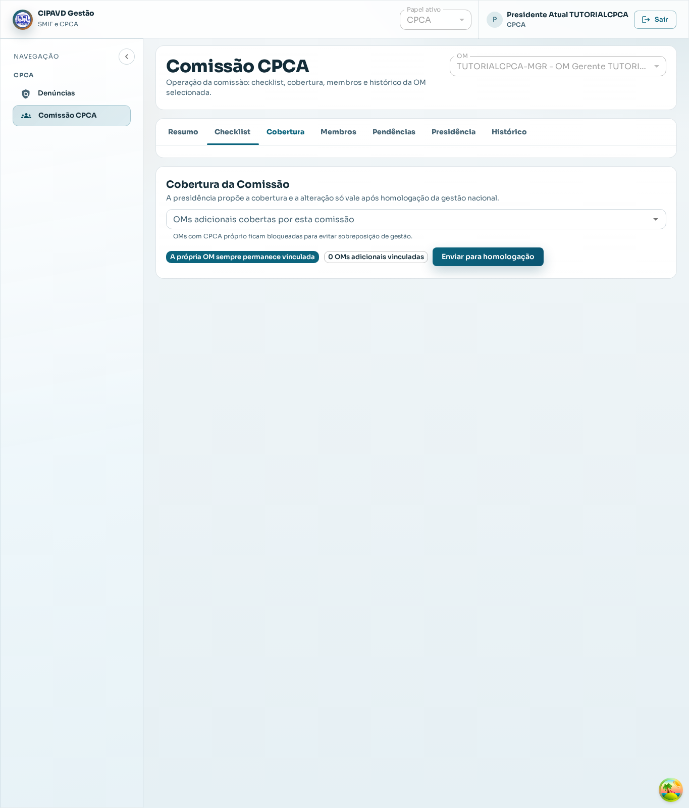

## 7. Cadastrar membros da comissão

No bloco **Membros da Comissão**, informe o e-mail ou CPF do militar e clique em **Adicionar membro**.

O sistema localiza o militar. Os membros cadastrados passam a aparecer na tabela abaixo do campo de inclusão.

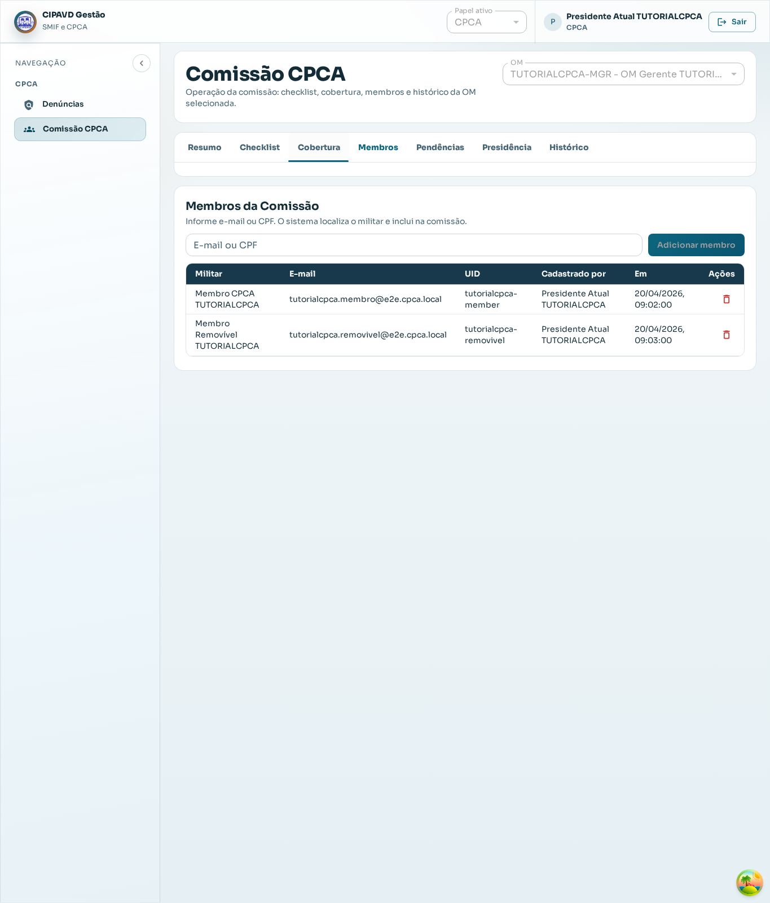

## 8. Cadastrar uma nova denúncia

Acesse **CPCA > Denúncias** e clique em **Nova notificação**.

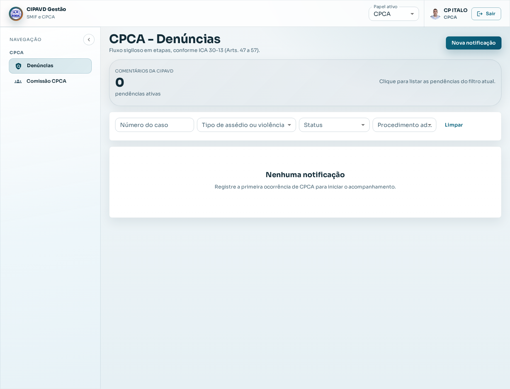

### Etapa 1: Notificação e fato

Preencha a OM, o tipo de assédio ou violência, o noticiante, as datas, o local da ocorrência, os dados genéricos do acusado e da vítima, a frequência, a relação funcional, a forma de ocorrência e o resumo do fato.

Use apenas dados genéricos. Não informe nomes de pessoas no resumo.

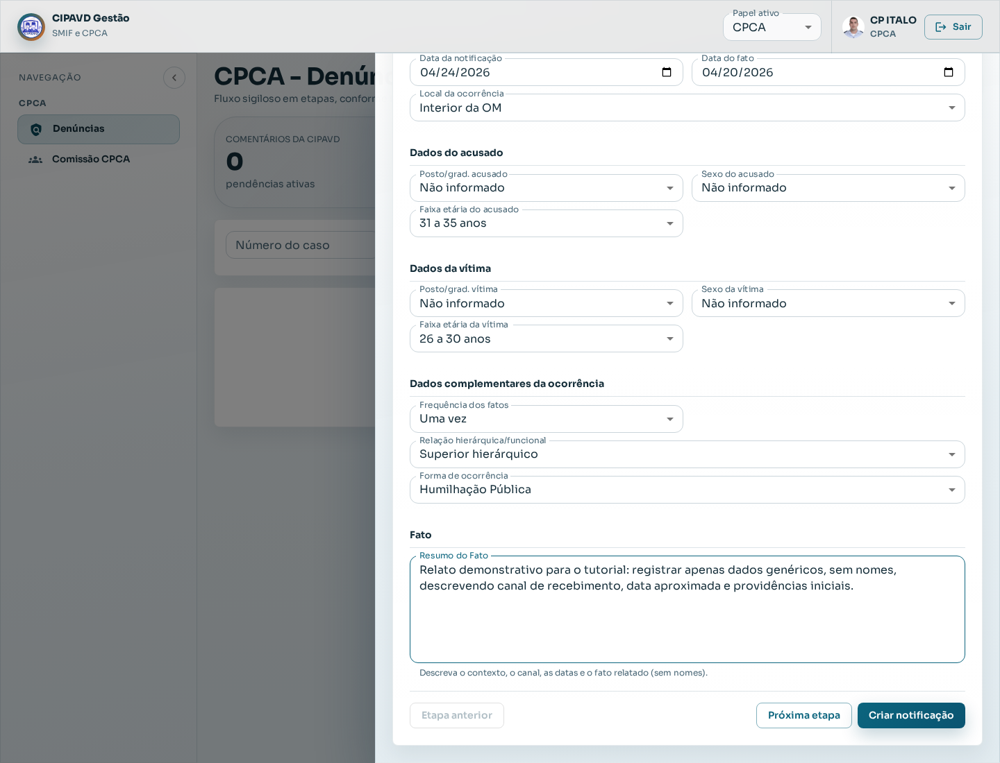

### Etapa 2: Acolhimento e proteção

Registre as medidas imediatas tomadas pela comissão, como acolhimento, orientação, suporte psicológico, suporte social, restrição de contato e termo de sigilo.

Depois clique em **Próxima etapa**.

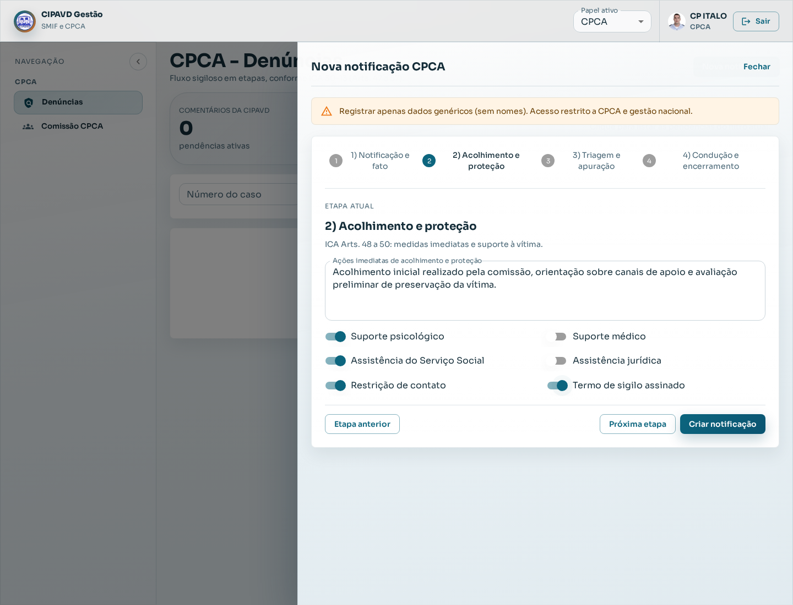

### Etapa 3: Triagem e apuração

Informe o status da triagem, o procedimento administrativo, a situação atual do procedimento, a referência do processo e a data do relatório.

Depois clique em **Próxima etapa**.

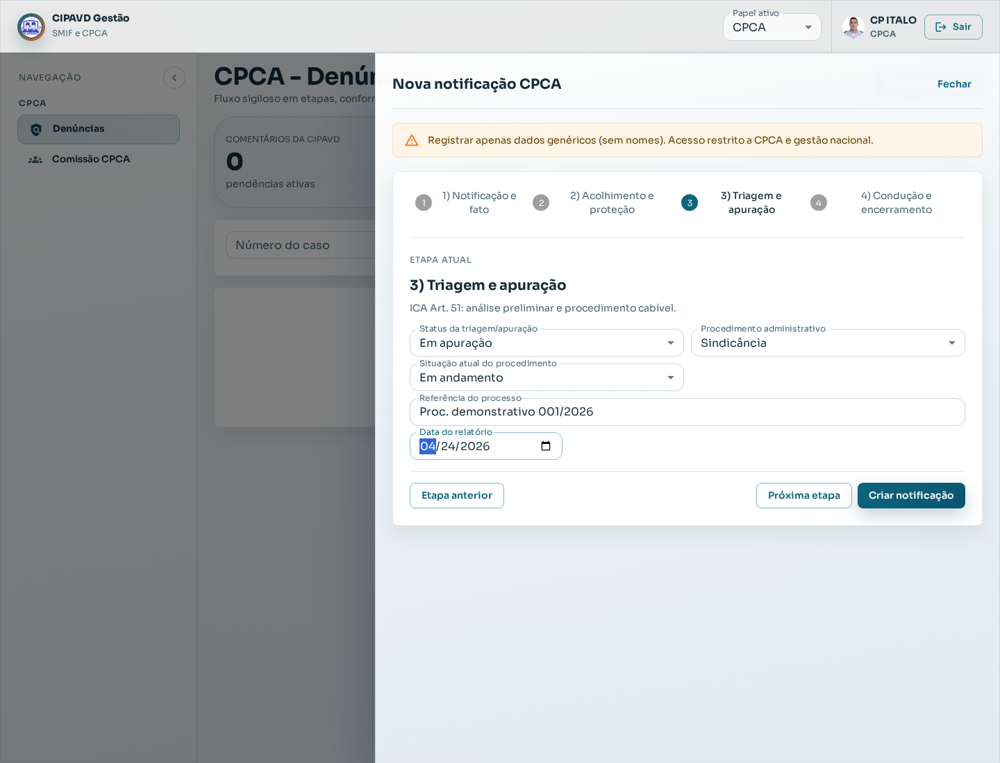

### Etapa 4: Condução e encerramento

Registre a situação final ou atual, a medida de separação vítima/acusado, eventual retaliação, retornos ao noticiante e à vítima, e a síntese do resultado.

Revise todas as informações. Quando estiver tudo correto, clique em **Criar notificação** para salvar a denúncia.

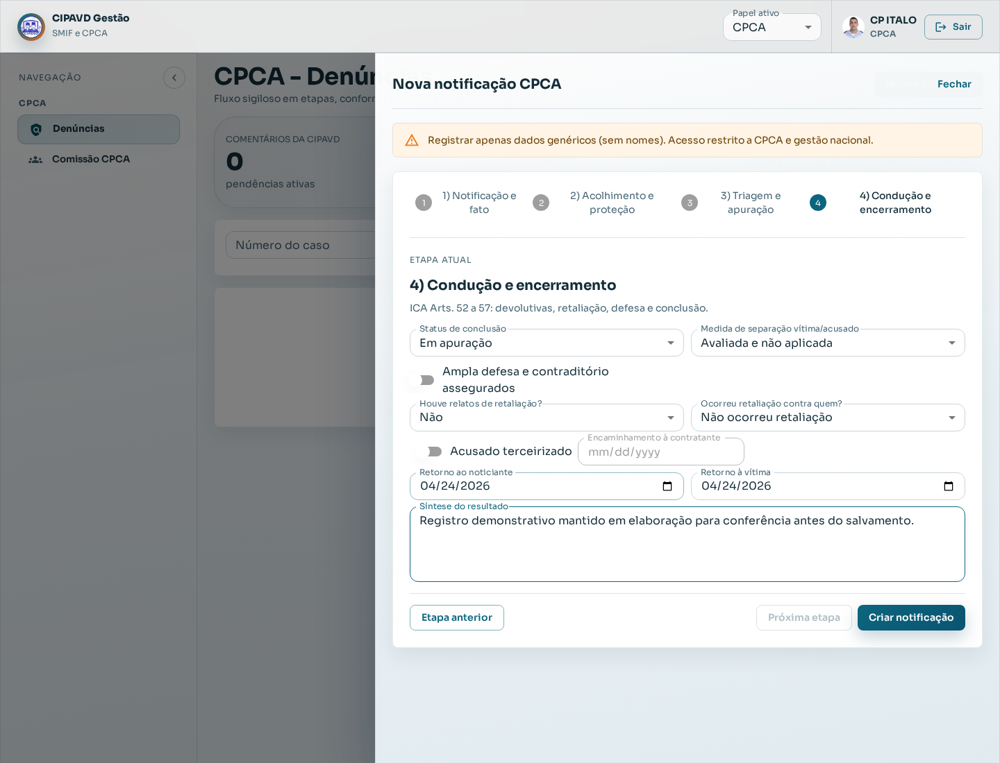
